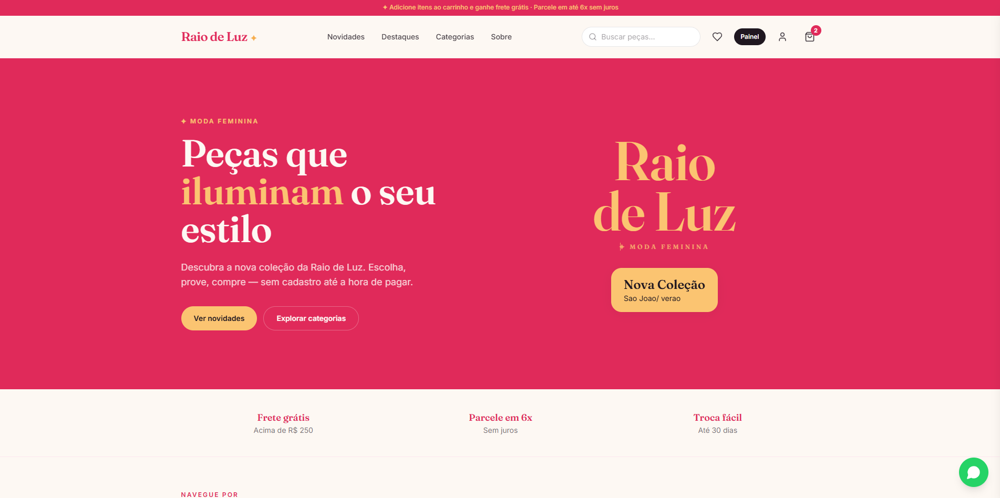
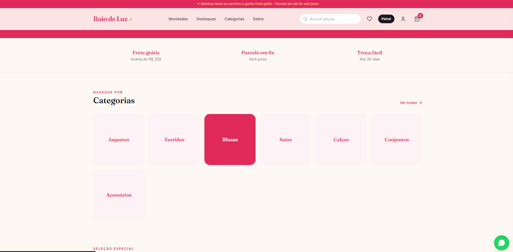
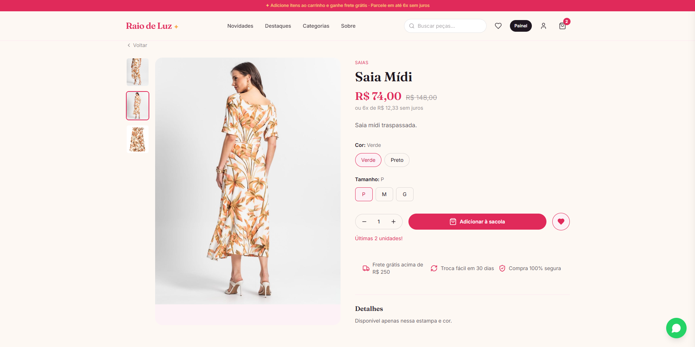
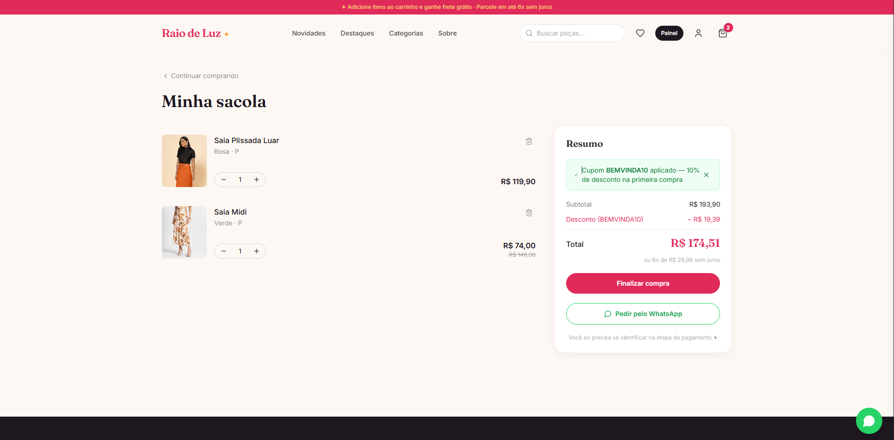
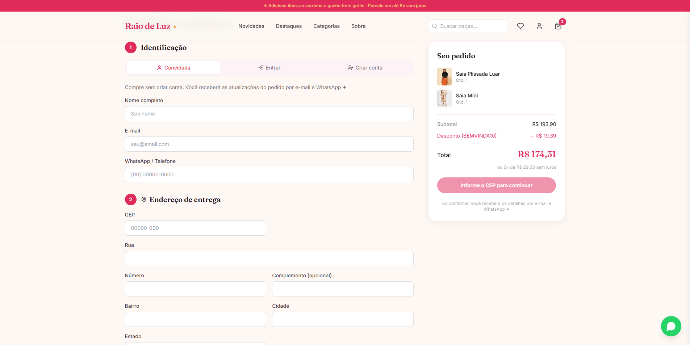
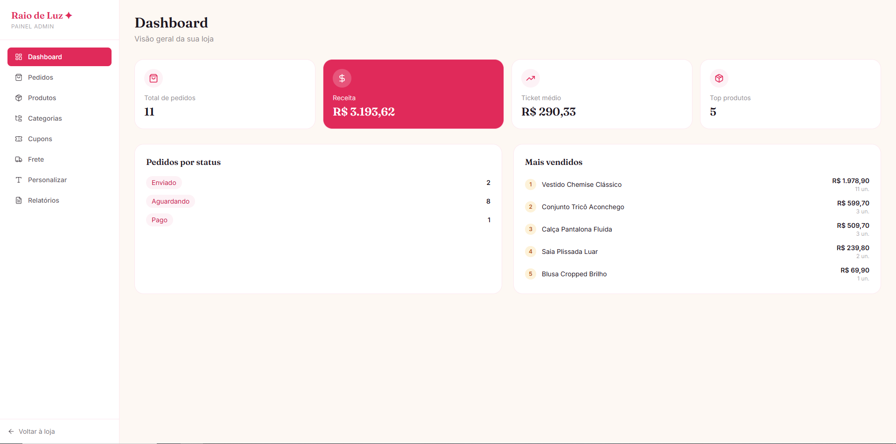
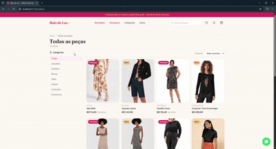
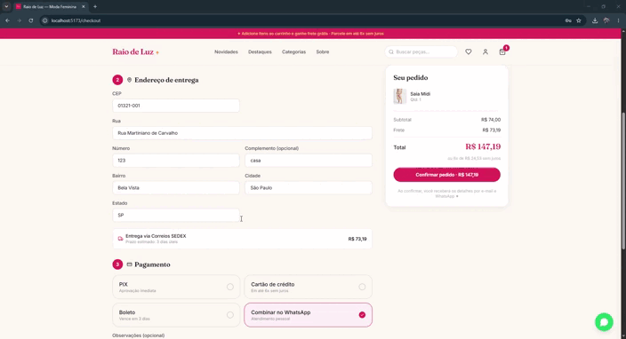
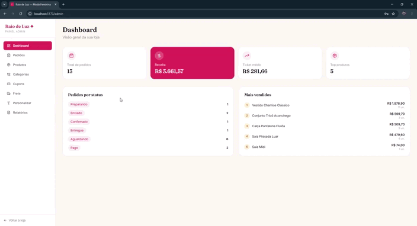

<div align="center">

<!-- ============================================ -->
<!--  ESPACO PARA O LOGO DA LOJA                  -->
<!--  Substitua o caminho abaixo pela sua logo    -->
<!-- ============================================ -->


# Raio de Luz — E-commerce de Moda Feminina

**Loja virtual completa, do catalogo ao pagamento real, com painel administrativo.**

[](https://react.dev)
[](https://www.typescriptlang.org)
[](https://nodejs.org)
[](https://www.prisma.io)
[](https://tailwindcss.com)
[](https://www.docker.com)

</div>

---

<!-- ============================================ -->
<!--  ESPACO PARA VIDEO/GIF DE DEMONSTRACAO       -->
<!--  Cole aqui um GIF mostrando a loja em acao   -->
<!--  Dica: grave a tela navegando pela loja e    -->
<!--  converta para GIF (ex: ScreenToGif, Kap)    -->
<!-- ============================================ -->

<div align="center">

### Demonstracao

<!-- Substitua pelo seu GIF/video de demonstracao geral -->


*Navegacao completa: da vitrine ao checkout*

</div>

---

## Sobre o projeto

A **Raio de Luz** e uma loja virtual de moda feminina desenvolvida do zero, com todas as funcionalidades de um e-commerce profissional: catalogo com variantes, carrinho sem necessidade de cadastro, checkout com pagamento real via Mercado Pago, calculo de frete pelos Correios, notificacoes automaticas por e-mail e um painel administrativo completo para gerir a loja.

O projeto foi pensado para uma operacao real — nao e uma demonstracao. Tudo que uma lojista precisa para vender online esta aqui: gestao de produtos e estoque, cupons de desconto, promocoes de frete gratis configuraveis, relatorios de vendas e personalizacao da loja, sem precisar mexer em codigo.

---

## Funcionalidades

### Loja (cliente)

| Funcionalidade | Descricao |
|----------------|-----------|
| **Catalogo com variantes** | Produtos com cores e tamanhos, cada combinacao com seu proprio estoque |
| **Vitrine inteligente** | Destaques, novidades e navegacao por categorias com imagem |
| **Busca** | Pesquisa de produtos por nome e descricao |
| **Carrinho sem login** | O cliente monta a sacola sem precisar criar conta |
| **Favoritos** | Cliente logado pode salvar pecas favoritas |
| **Checkout em etapas** | Identificacao, entrega e pagamento — login so na hora de pagar |
| **CEP automatico** | Endereco preenchido automaticamente via ViaCEP |
| **Sinalizacao de estoque** | Selo "Esgotado", variantes esgotadas riscadas, aviso de "ultimas unidades" |
| **Conta do cliente** | Historico de pedidos, favoritos e dados pessoais |
| **Pagina institucional** | Pagina "Sobre" com a historia e valores da loja |

### Pagamento e frete

| Funcionalidade | Descricao |
|----------------|-----------|
| **Mercado Pago (Checkout Pro)** | Pagamento real com cartao, PIX e demais metodos |
| **Confirmacao automatica** | Pedido vira "Pago" sozinho via webhook |
| **Frete real (Melhor Envio)** | Calculo automatico pelos Correios (PAC, SEDEX) por peso e CEP |
| **Frete inteligente** | Sistema escolhe a opcao mais segura; fallback por regiao se a API falhar |
| **Frete gratis configuravel** | Promocao com regra anti-prejuizo (so da gratis quando compensa) |

### Painel administrativo

| Funcionalidade | Descricao |
|----------------|-----------|
| **Dashboard** | Visao geral de vendas e pedidos |
| **Gestao de pedidos** | Acompanhamento e mudanca de status |
| **Gestao de produtos** | Criar/editar produtos, variantes, estoque e fotos |
| **Upload de imagens** | Envio de fotos com Cloudinary (e fallback local) |
| **Gestao de categorias** | Criar/editar categorias com imagem |
| **Gestao de cupons** | Criar/editar cupons de desconto (% ou valor fixo) |
| **Configuracao de frete** | Liga/desliga e ajusta a promocao de frete gratis |
| **Personalizacao** | Edita textos da loja (barra de anuncio, destaque da home) |
| **Relatorios** | Exportacao de relatorios de vendas em PDF por periodo |

### Notificacoes

- E-mail automatico de **pedido confirmado** e **pedido enviado** (via Gmail SMTP)
- Integracao com **WhatsApp** centralizada (botao de contato em toda a loja)

---

<!-- ============================================ -->
<!--  GALERIA DE TELAS — ESPACO PARA FOTOS        -->
<!--  Tire prints das principais telas e cole.    -->
<!-- ============================================ -->

## Galeria

### Pagina inicial
<!-- Print da home -->


### Catalogo e produto
<!-- Coloque dois prints lado a lado, se quiser -->
<p>
  
  
</p>

### Carrinho e checkout
<p>
  
  
</p>

### Painel administrativo
<!-- Print do dashboard admin -->


<!-- ============================================ -->
<!--  GIFS DE FLUXOS ESPECIFICOS                  -->
<!--  Bom para mostrar interacoes ao vivo:        -->
<!--  - adicionar ao carrinho                      -->
<!--  - finalizar uma compra                       -->
<!--  - usar o painel admin                        -->
<!-- ============================================ -->

### Fluxos em acao

| Comprando | Pagamento | Admin |
|:---:|:---:|:---:|
|  |  |  |

---

## Tecnologias

### Frontend
- **React 18** + **TypeScript** — interface da loja e do painel
- **Vite** — build e desenvolvimento
- **Tailwind CSS** — estilizacao com identidade visual propria
- **React Router** — navegacao
- **Zustand** — gerencia de estado (carrinho, autenticacao, etc.)
- **TanStack Query** — busca e cache de dados
- **Lucide React** — icones

### Backend
- **Node.js** + **Express** + **TypeScript** — API REST
- **Prisma ORM** — acesso ao banco de dados
- **PostgreSQL** — banco de dados
- **JWT** — autenticacao
- **Nodemailer** — envio de e-mails
- **Multer** + **Cloudinary** — upload de imagens

### Integracoes
- **Mercado Pago** — processamento de pagamentos (Checkout Pro)
- **Melhor Envio** — calculo de frete (Correios)
- **ViaCEP** — consulta de enderecos por CEP
- **Gmail SMTP** — notificacoes por e-mail

### Infraestrutura
- **Docker** + **Docker Compose** — containerizacao (dev e producao)
- **Nginx** — servidor web do frontend em producao
- **PostgreSQL** — banco de dados em container

---

## Identidade visual

O projeto tem uma identidade visual propria, pensada para transmitir a delicadeza e o brilho da marca:

| Cor | Uso | Codigo |
|-----|-----|--------|
| Rosa | Cor primaria | `#e02a5a` |
| Dourado | Acento | `#fbc471` |
| Creme | Fundo | `#fdf8f3` |
| Carvao | Texto | `#1f1720` |

**Tipografia:** Fraunces (titulos) + Inter (corpo)

---

## Como rodar o projeto

### Pre-requisitos

- **Node.js** 18 ou superior
- **PostgreSQL** instalado e rodando
- Conta no **Mercado Pago** (para pagamentos)
- Conta no **Melhor Envio** (para frete)
- Conta **Gmail** com senha de app (para e-mails)

### 1. Clonar o repositorio

```bash
git clone https://github.com/SEU-USUARIO/raio-de-luz.git
cd raio-de-luz
```

### 2. Configurar o Backend

```bash
cd backend
npm install

# Copie o arquivo de exemplo e preencha com suas credenciais
cp .env.example .env

# Rode as migrations para criar as tabelas
npx prisma migrate dev

# Popule o banco com dados iniciais (admin, categorias, produtos)
npm run db:seed

# Inicie o servidor
npm run dev
```

O backend ficara disponivel em `http://localhost:3333`.

### 3. Configurar o Frontend

```bash
cd frontend
npm install
npm run dev
```

A loja ficara disponivel em `http://localhost:5173`.

### 4. Acessar o painel administrativo

Acesse `http://localhost:5173/admin` e entre com as credenciais padrao do seed:

- **E-mail:** `admin@raiodeluz.com`
- **Senha:** `admin123`

> **Importante:** troque essas credenciais antes de colocar a loja no ar.

---

## Rodar com Docker

O projeto e totalmente containerizado. Com Docker, voce sobe a loja inteira (banco + backend + frontend) com um comando, sem instalar Node nem PostgreSQL na maquina.

### Pre-requisitos
- [Docker](https://www.docker.com/products/docker-desktop/) e Docker Compose instalados

### Desenvolvimento (com hot-reload)

Sobe tudo com recarregamento automatico ao editar o codigo:

```bash
# Configure as credenciais do backend primeiro
cp backend/.env.example backend/.env   # e preencha

# Suba o ambiente de desenvolvimento
docker compose -f docker-compose.dev.yml up
```

- Loja: `http://localhost:5173`
- API: `http://localhost:3333`
- Banco PostgreSQL: `localhost:5432`

O banco ja sobe junto e as migrations sao aplicadas automaticamente.

### Producao

Builda tudo otimizado (backend compilado, frontend servido por Nginx):

```bash
# 1. Configure as variaveis do banco na raiz
cp .env.example .env                    # e defina POSTGRES_PASSWORD

# 2. Configure as credenciais do backend
cp backend/.env.example backend/.env    # Mercado Pago, Melhor Envio, Gmail, etc.

# 3. Suba em producao
docker compose up -d --build
```

A loja fica disponivel em `http://localhost` (porta 80). O frontend serve via Nginx e encaminha as chamadas `/api` para o backend automaticamente.

### Comandos uteis

```bash
docker compose logs -f              # ver logs em tempo real
docker compose down                 # parar tudo
docker compose down -v              # parar e apagar o banco (cuidado!)
docker compose exec backend sh      # entrar no container do backend
```

### Estrutura Docker

```
raio-de-luz/
├── docker-compose.yml          # Producao (banco + backend + nginx)
├── docker-compose.dev.yml      # Desenvolvimento (com hot-reload)
├── .env.example                # Variaveis do banco (Docker)
├── backend/
│   ├── Dockerfile              # Build de producao (multi-stage)
│   └── Dockerfile.dev          # Dev com hot-reload
└── frontend/
    ├── Dockerfile              # Build + Nginx (producao)
    ├── Dockerfile.dev          # Dev com Vite
    └── nginx.conf              # Configuracao do Nginx
```

---

## Configuracao das integracoes

Todas as credenciais ficam no arquivo `backend/.env`. Veja o `.env.example` para a lista completa e comentada. Resumo das principais:

### Mercado Pago
1. Crie uma aplicacao em [Mercado Pago Developers](https://www.mercadopago.com.br/developers)
2. Para testes, use as credenciais de **teste** (comecam com `TEST-`)
3. Preencha `MP_ACCESS_TOKEN` e `MP_PUBLIC_KEY`
4. Para o webhook funcionar localmente, use o [ngrok](https://ngrok.com) e coloque a URL gerada em `API_URL`

### Melhor Envio
1. Crie conta em [Melhor Envio](https://melhorenvio.com.br) (basta CPF)
2. Para testes, use o ambiente **sandbox**
3. Gere um token em **Gerenciar -> Tokens**
4. Preencha `MELHOR_ENVIO_TOKEN`, `MELHOR_ENVIO_SANDBOX` e `STORE_CEP_ORIGEM`

### Gmail (e-mails)
1. Ative a **verificacao em duas etapas** na conta Google
2. Gere uma **senha de app** em [myaccount.google.com/apppasswords](https://myaccount.google.com/apppasswords)
3. Preencha `SMTP_USER` (seu e-mail) e `SMTP_PASS` (a senha de app)

---

## Estrutura do projeto

```
raio-de-luz/
|-- backend/
|   |-- prisma/
|   |   +-- schema.prisma          # Modelos do banco de dados
|   +-- src/
|       |-- config/                # Configuracao (env, prisma, seed)
|       |-- middlewares/           # Autenticacao e admin
|       |-- modules/               # Funcionalidades por dominio:
|       |   |-- auth/              #   autenticacao
|       |   |-- products/         #   produtos
|       |   |-- orders/           #   pedidos
|       |   |-- cart/             #   carrinho
|       |   |-- categories/       #   categorias
|       |   |-- coupons/          #   cupons
|       |   |-- favorites/        #   favoritos
|       |   |-- payments/         #   pagamento (Mercado Pago)
|       |   |-- shipping/         #   frete (Melhor Envio)
|       |   |-- settings/         #   configuracoes da loja
|       |   |-- notifications/    #   e-mails
|       |   |-- reports/          #   relatorios PDF
|       |   |-- profile/          #   perfil do cliente
|       |   +-- upload/           #   upload de imagens
|       +-- shared/                # Utilitarios (respostas, erros)
|
+-- frontend/
    +-- src/
        |-- components/            # Componentes reutilizaveis
        |   |-- layout/           #   Header, Footer, CartDrawer
        |   +-- ui/               #   ProductCard, OrderSummary, etc.
        |-- pages/                # Paginas da loja
        |   +-- admin/            #   Paginas do painel
        |-- store/                # Estado global (Zustand)
        |-- hooks/                # Hooks de dados (React Query)
        +-- lib/                  # Utilitarios (API, formatacao, CEP)
```

---

## Modelo de dados

O banco e estruturado em torno destes modelos principais:

- **User** — usuarios (clientes e admin)
- **Product** + **ProductVariant** + **ProductImage** — produtos com variantes e fotos
- **Category** — categorias de produtos
- **Cart** + **CartItem** — carrinho de compras
- **Order** + **OrderItem** — pedidos
- **Coupon** — cupons de desconto
- **Favorite** — produtos favoritos
- **Notification** — registro de notificacoes
- **StoreSetting** — configuracoes da loja (frete gratis, textos)
- **Address** — enderecos dos clientes

---

## Seguranca

- Senhas armazenadas com **hash bcrypt**
- Autenticacao via **JWT**
- Rotas administrativas protegidas por middleware
- Credenciais sensiveis fora do codigo (`.env` no `.gitignore`)
- Validacao de estoque no servidor (impede vender o que nao ha)

---

## Status e proximos passos

### Implementado
- Loja completa (catalogo, carrinho, checkout, conta)
- Pagamento real com confirmacao automatica
- Frete real com calculo automatico
- Painel administrativo completo
- Notificacoes por e-mail

### Roadmap
- [ ] Deploy em producao (dominio proprio, sem ngrok)
- [ ] PIX em producao (cadastrar chave na conta real)
- [ ] Avaliacoes de produtos (estrelas e comentarios)
- [ ] Busca avancada (filtros por cor, tamanho, preco)
- [ ] WhatsApp automatico (notificacoes via Evolution API)

---

## Autor

Desenvolvido com dedicacao para a **Raio de Luz**.

<!-- ============================================ -->
<!--  ESPACO PARA INFORMACOES DE CONTATO          -->
<!-- ============================================ -->

<div align="center">

**Raio de Luz** — Moda feminina que ilumina o seu dia

[Instagram](https://instagram.com/lojaraiodeluzpb) - [WhatsApp](https://wa.me/5583998154641)

</div>

---

<div align="center">
<sub>Este projeto foi construido como uma solucao de e-commerce completa e funcional.</sub>
</div>
